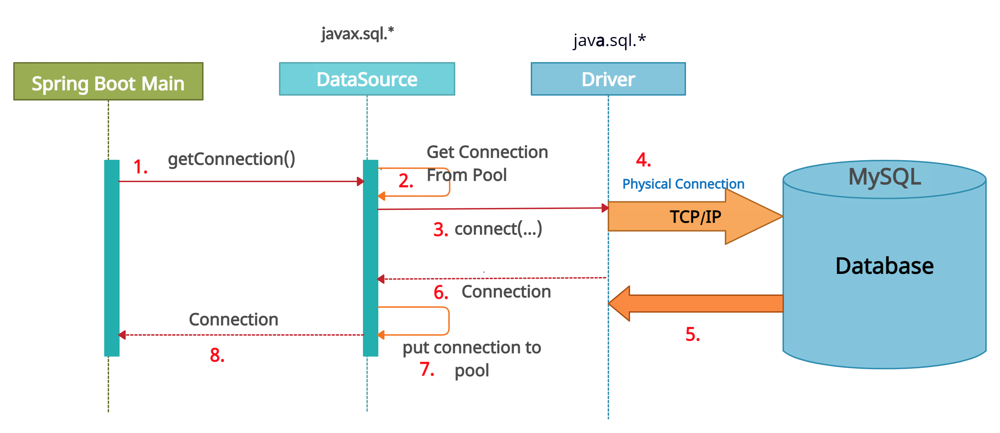
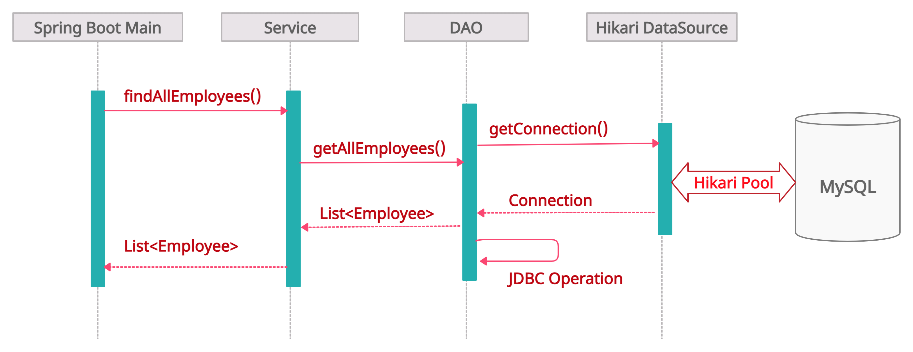

<h2> <em>Lombok-ize Java application - Spring Boot 2 + MySQL + HikariCP<sup><sup>&nbsp;<B>It's Faster.</B></sup></sup> connection pooling. </em></h2>

<h3> Sample Application with Lombok + Spring Boot 2 + HikariCP +JDBC +  MySQL Database </h3>

Fast, simple, reliable.  [HikariCP](https://github.com/brettwooldridge/HikariCP/wiki/Down-the-Rabbit-Hole) is a "zero-overhead" production ready JDBC connection pool.  At roughly 130Kb, the library is very light.

<h3> Project Requirements </h3>

- [Amazon Corretto](https://docs.aws.amazon.com/corretto/) - JDK 1.8+ or higher.
- [Apache Maven 3.8.1 ](https://maven.apache.org/download.cgi) - Maven Build Tool.
- [Spring Framework ](https://spring.io/) - Spring Version 5.3.9.
- [Oracle MySQL Database](https://dev.mysql.com/downloads/mysql/) - Community Edition ,Version 5.8
- [Eclipse IDE for Enterprise Java and Web Developers](https://www.eclipse.org/downloads/packages/) - IDE Version: 2021-06
- [Lombok plugin installed in your Eclipse IDE](https://projectlombok.org/setup/overview)


<h3> HikariCP Maven Dependency </h3>

<em><B>Maven artifact:</B></em>

```xml
<dependency>
   <groupId>com.zaxxer</groupId>
   <artifactId>HikariCP</artifactId>
   <version>5.0.0</version>
</dependency>
```
<h3> Lombok Maven Dependency </h3>

<em><B>Maven artifact:</B></em>

```xml
<dependency>
  <groupId>org.projectlombok</groupId>
  <artifactId>lombok</artifactId>
  <version>1.18.20</version>
</dependency>
```

<h3> Installation </h3>

This application requires Java 1.8+ , Maven build tool, MySQL 5.7x must be installed in the local machine.


- MySQL database server running locally with the respective port number, username and password.

- Create database, tables as provided in <em><B>springboot-lombok-hikari-mysql\mysql_scripts\*.sql</B></em>

- Download sample application in your machine through GitHub.

- Import as a Maven project in your IDE (Here, Eclipse is used) of your choice.

- In your terminal window, Navigate to your project directory location and execute below command.  
This will execute test class DataSourceTest.java to test your main boot application.

```sh

..\springboot-lombok-hikari-mysql> mvn clean package

```
- To skip test class DataSourceTest.java , execute below maven command :

```sh

..\springboot-lombok-hikari-mysql> mvn clean package -Dmaven.test.skip=true

```
- Once Maven build is success, execute maven command to run Sprng boot application :

```sh

..\springboot-lombok-hikari-mysql> mvn spring-boot:run

```

- Navigate to <B> `SpringBootLombokMain.java` </B> in your IDE and run this class as Java or SpringBoot application.

<h3> Connection Pool Sequence Diagram </h3>



<h3> Business Sequence Diagram - findAllEmployees() </h3>



<h3> Database Diagram </h3>


<h3> License </h3>

Licensed under GNU General Public License v3.0. Please see [LICENSE](LICENSE) for details.


**Happy Learning !**